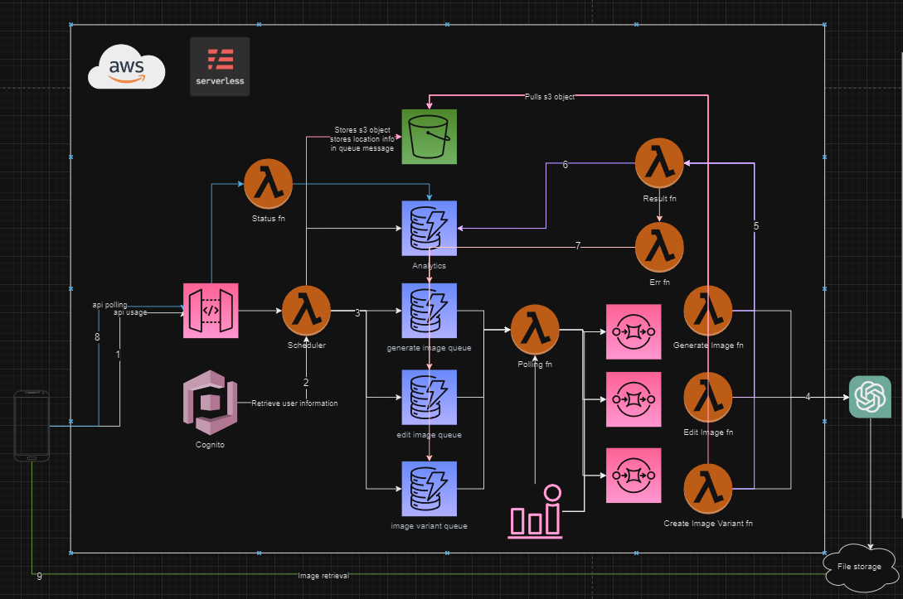

# PixelArt
PixelArt is designed to be a serverless api built for working with OpenAI API in an event driven architectural approach.

## Environment Setup
All anyone needs to work with this project is Docker. Dev container configuration files are stored under the `.devcontainer` directory. Open the project inside and the environment is complete

## Secret Setup
Due to limitations in Earthly, the aws access key and secret key must be provided at build time and stored in the `.secret` file. Copy the `example.secret` file to that location and replace the values with ones appropriate for your account.

Copy the `infrastructure/example.tfvars` to `infrastructure/auto.tfvars` for terraform deployment. Fill in the values that are appropriate for your environment. You will need a registered domain in route53 and hosted zone.

## Deployment
Run `earthly +deploy` from the root of the project. Earthly is used as the monorepo manager and build system orchestrator. This will compile all of the go functions, pull them into the terraform container, zip them up, and deploy them to s3 buckets for lambdas to pull from. 

